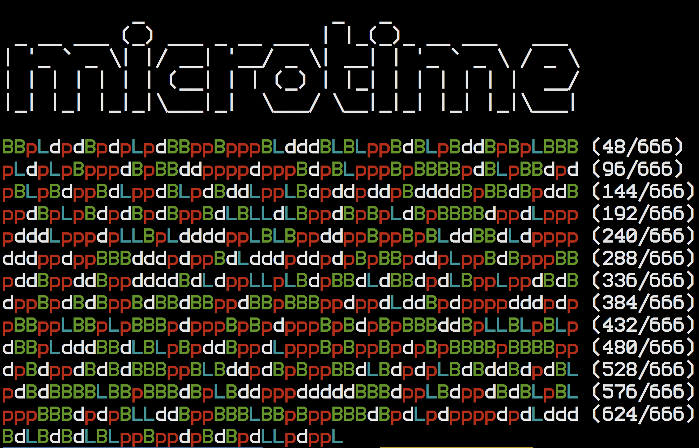
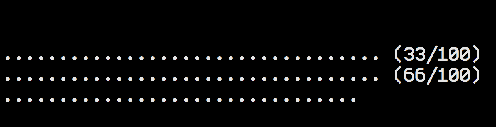

# Biberon




## Example

```php
use Sensorario\Biberon\Biberon;
use Sensorario\Biberon\Detector;
use Sensorario\Biberon\Stat;

$detector = new Detector();

echo "\n";
echo "\n";

$stat = new Stat();
$stat->init([
    'count' => 100,
    'column' => 0,
    'print' => 0,
    'columnsize' => 33,
]);

for ($i = 0; $i < 100; $i++) {
    usleep(1000);
    $item = rand(11111, 99999);
    $detector->echoDetection($item);
    $stat->step();
}

echo "\n";
echo "\n";
```
